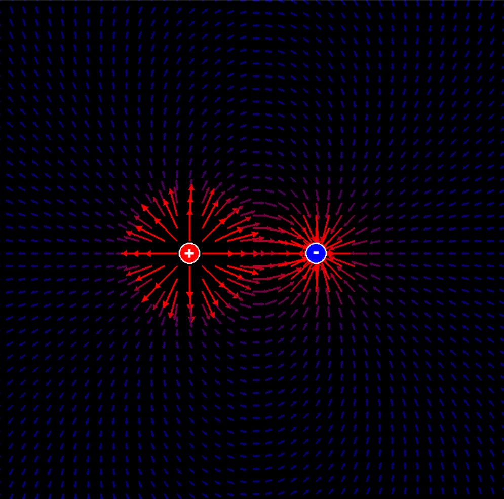
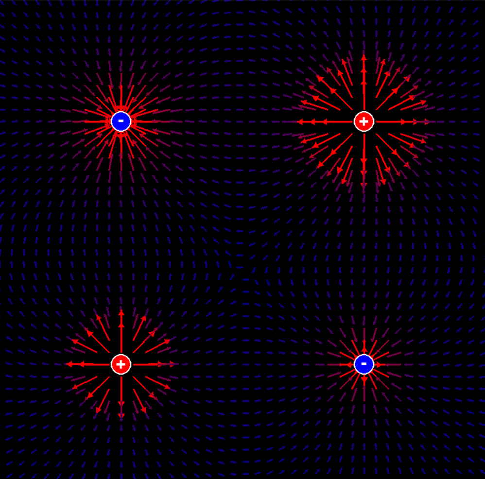
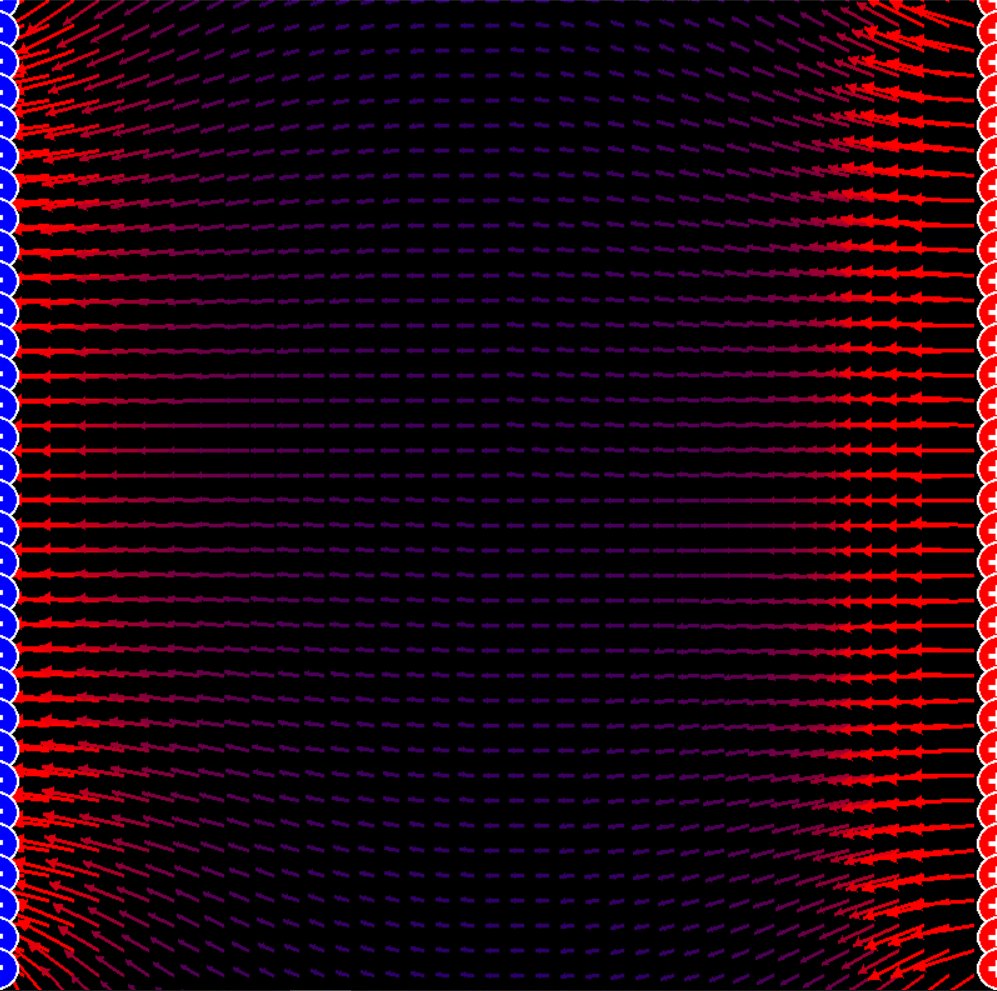
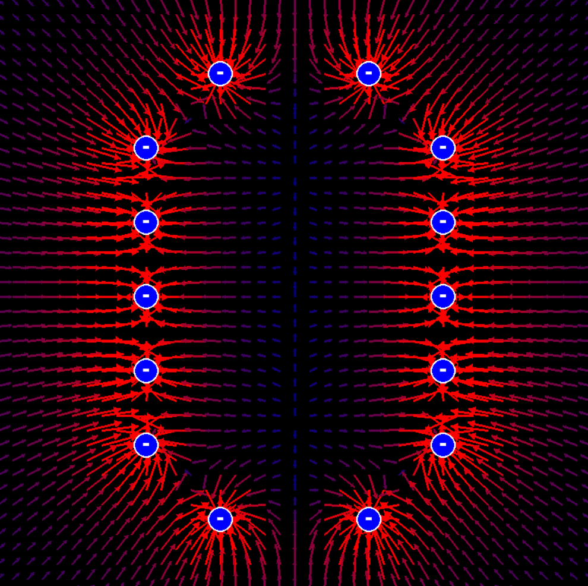
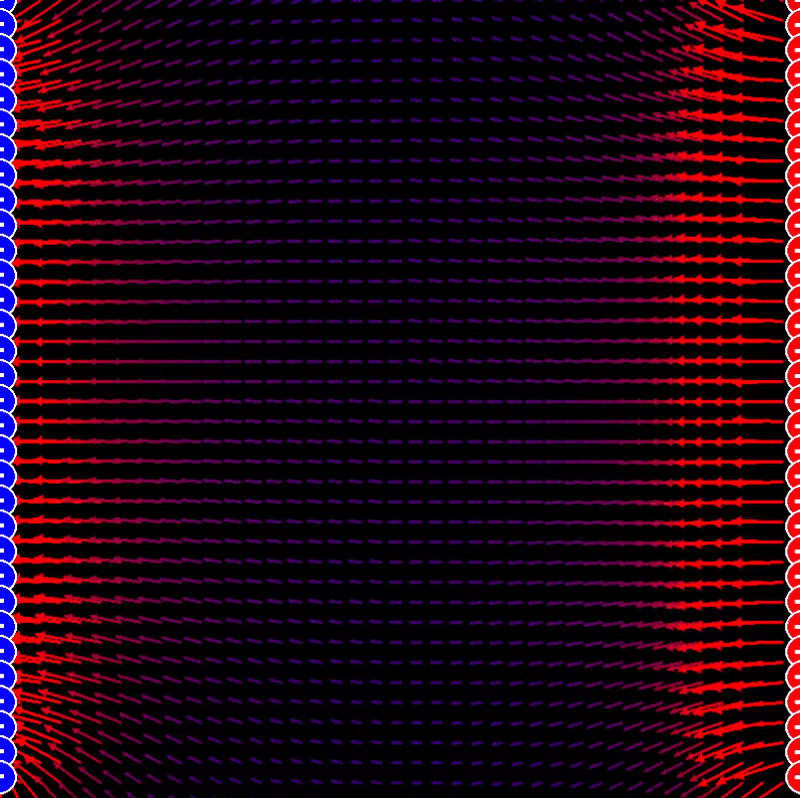
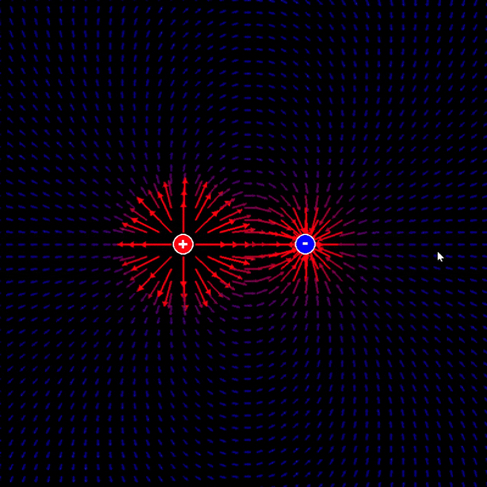
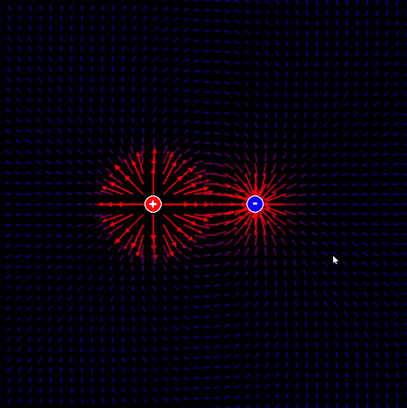
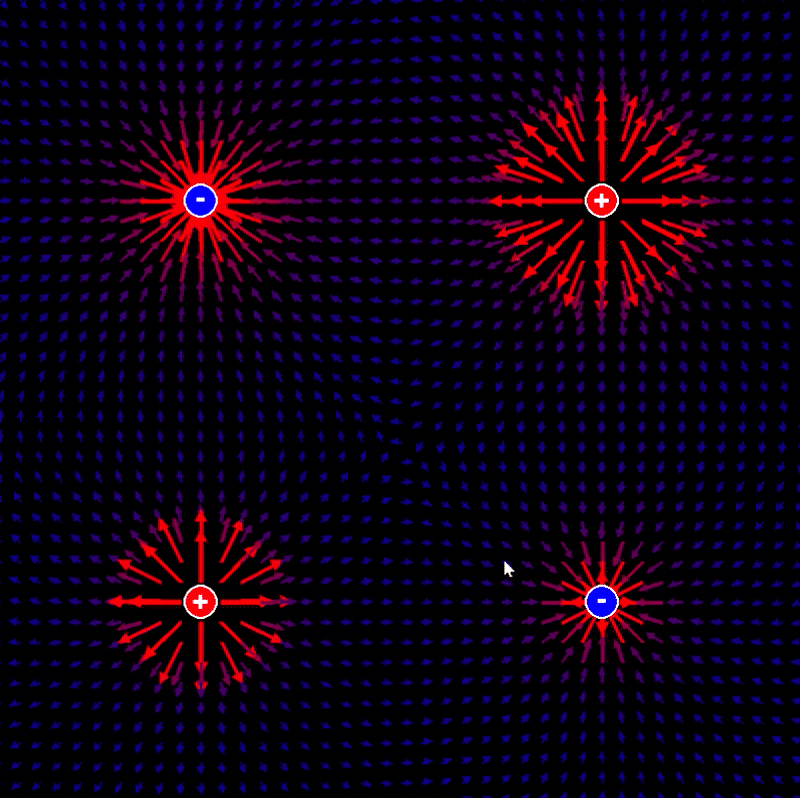

# Electric Field Simulator
[](https://github.com/Flaks45/Electric-field)

A visual simulator for electric fields with interactive particle dynamics.

# Installation
**Python 3.9 or higher is required.**
To install the dependencies for this project run the following command:
```bash
# Linux/macOS
python3 -m pip install -r requirements.txt

# Windows
py -3 -m pip install -r requirements.txt
```

# Usage
Run the simulation with `main.py`.

<div>
  
</div>

This will launch the main window. Charges are hardcoded in main.py, so edit that file to customize, add, or remove them. 
You can use as many charges as you like.
> Charge values should be in the microcoulomb (µC) range for reasonable results.

# Field Examples
<div>
  
  
  
</div>

The canvas size is **800×800 meters**, so coordinate values and distances are treated as real-world scale.

# Physics
Force on a particle is calculated using the electric field equation:
```math
\vec{F} = q\vec{E}
```
Each individual field contribution follows:
```math
\vec{E}_n = \frac{1}{4\pi\varepsilon_0} \cdot \frac{q_n}{r_n^2} \hat{r}_n
```

# Particle Simulation
Particles can be added interactively during the simulation. **They will appear at your mouse position.**
> Controls (keyboard):
- `r` Clear particles.
- `1` Electron.
- `2` Positron.
- `3` Proton.
- `4` Neutron.
- `5` Electron ring.
- `6` Positron ring.

Simulations with electrons:
<div>
  
  
  
</div>

Neutrons and protons example:
<div>
  
</div>

And positrons examples:
<div>
  
  
  
</div>

# Notes
- Neutrons have no charge and do not respond to the field but are included for reference.
- **Time has been slowed down in the simulation.** Search for `slow_factor` in `main.py` if you wish to change it. Default value is at 1 second every 10000 steps (or 1 second every 10000 simulation seconds).
- You can visualize forces if you enable the bool `SHOW_FORCES` in `objects.py`. It looks like this:
<div>
  
</div>
